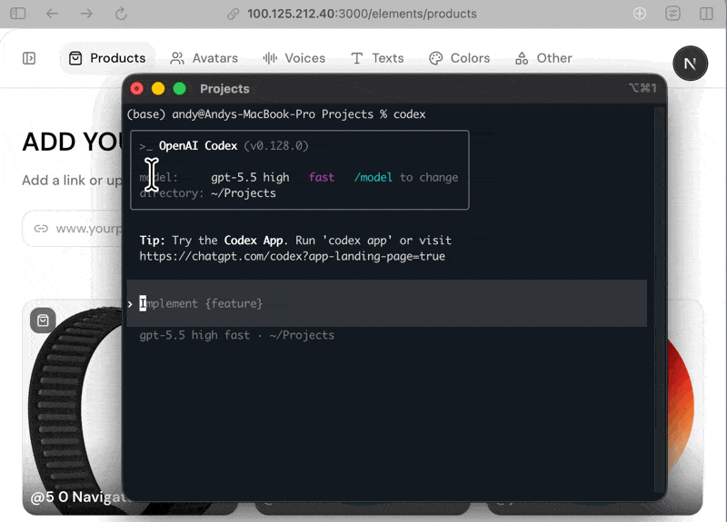

# LLM Pointer



Point at any element on the page and instantly tell Claude Code, Codex, or any
other coding LLM **which one you mean**. One click copies a structured reference
— React component name, CSS selector, surrounding context, visible text — that
you drop into your prompt. There's also a record mode: hold a session, speak
your intent while clicking the elements you want changed, and get back a single
timestamped transcript that interleaves what you said with what you pointed at.

The loadable extension lives in [`llm-pointer-ext/`](./llm-pointer-ext). Point
Chrome's "Load unpacked" at that folder.

## Install (load unpacked)

1. Open `chrome://extensions`.
2. Toggle **Developer mode** (top right).
3. Click **Load unpacked** and select the `llm-pointer-ext/` folder in this repo.
4. Pin the extension from the puzzle-piece menu so the toolbar icon is visible.

After editing any file in `llm-pointer-ext/`, hit the **reload** icon on the
extension's card in `chrome://extensions` to pick up changes. (You don't need to
re-load-unpacked.)

## Use

1. Open any page.
2. Click the **LLM Pointer** toolbar icon → a dark bar appears at the bottom.
3. **Hover** any element to preview the selector.
4. **Click** to copy a `## User pointed at this element` block to your clipboard.
5. **↑ / ↓** walks the DOM up to parent / down toward the cursor's target.
6. **Esc** exits.

The copied block includes: page path, viewport position, React component name
(when detectable), short CSS selector, sibling context ("3 of 6 Cards in a 3-col
grid"), visible text, tag, and pixel size. Designed to paste straight into a
Claude / Codex prompt as "this is the element I'm referring to."

## Record mode (Deepgram)

Click the red dot in the bar to start recording. Speak while clicking elements;
each click is logged with a timestamp. Click the stop square to send the audio to
Deepgram and get a merged transcript like:

```
[00:00] So this card here looks broken
  → [clicked at 00:03]:
  ## User pointed at this element
  ...
[00:06] and the spacing is wrong on this one too
  → [clicked at 00:09]:
  ...
```

Set your Deepgram API key via the gear icon in the bar. Key + language preference
are stored in `localStorage` for the page's origin (per-site).

## Files

```
llm-pointer-ext/
├── manifest.json   # MV3 manifest
├── background.js   # Service worker — injects content.js when toolbar icon clicked
├── content.js      # The whole UI + DOM picker + recorder, single-file
├── icon32.png
└── icon128.png
```

See [`CLAUDE.md`](./CLAUDE.md) for the architecture notes / editing conventions
agents (Claude Code, Codex) should follow when modifying this code.
